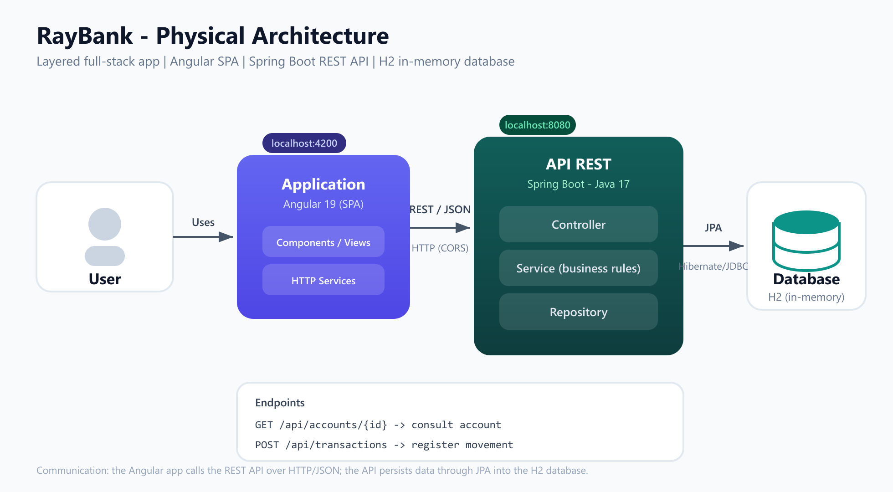
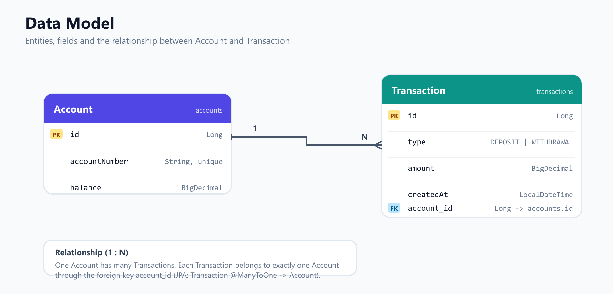

# RayBank — Aplicación Bancaria Fullstack

Aplicación fullstack que permite **consultar una cuenta bancaria** y **registrar movimientos** (depósitos y retiros). Construida con una arquitectura en capas, comunicación REST y un frontend que consume la API.

- **Backend:** Java 17 + Spring Boot + Spring Data JPA + H2 (en memoria)
- **Frontend:** Angular 19 (SPA)
- **Comunicación:** REST sobre HTTP (JSON)

---

## Arquitectura física



**Flujo de comunicación**

1. El usuario interactúa con la **aplicación Angular** (navegador).
2. La aplicación llama a la **API REST** mediante HTTP con cuerpos JSON.
3. La API procesa la petición a través de sus capas (**Controller → Service → Repository**) y aplica las reglas de negocio.
4. El **Repository** persiste y consulta los datos en la **base de datos H2** vía JPA/Hibernate.

---

## Arquitectura en capas (backend)

| Capa | Responsabilidad |
|------|-----------------|
| **Controller** | Expone los endpoints REST, recibe/responde HTTP y valida la entrada. |
| **Service** | Contiene la lógica y las reglas de negocio. |
| **Repository** | Acceso a datos con Spring Data JPA. |
| **Mapper** | Transforma entidades ↔ DTOs. |
| **DTO** | Objetos de transporte de datos (request/response). |
| **Exception** | Manejo centralizado de errores (`@RestControllerAdvice`). |

Se aplican principios **SOLID** (responsabilidad única por capa, inversión de dependencias mediante interfaces de service y mapper) y **Clean Code** (métodos pequeños, nombres descriptivos, sin duplicación).

---

## Endpoints

### 1. Consultar cuenta

```
GET /api/accounts/{id}
```

**Respuesta `200 OK`**

```json
{
  "id": 1,
  "accountNumber": "1001",
  "balance": 1000.00
}
```

**Errores:** `404 Not Found` si la cuenta no existe.

### 2. Registrar movimiento

```
POST /api/transactions
```

**Cuerpo**

```json
{
  "accountId": 1,
  "type": "DEPOSIT",
  "amount": 250.00
}
```

`type` admite `DEPOSIT` o `WITHDRAWAL`.

**Respuesta `201 Created`**

```json
{
  "id": 1,
  "type": "DEPOSIT",
  "amount": 250.00,
  "createdAt": "2026-06-18T16:30:00",
  "accountId": 1
}
```

---

## Reglas de negocio

| Regla | Resultado | HTTP |
|-------|-----------|------|
| El monto debe ser mayor a cero | `Amount must be greater than zero` | `400` |
| La cuenta debe existir | `Account not found with id: {id}` | `404` |
| Un retiro no puede superar el saldo | `Insufficient balance for account id: {id}` | `400` |
| Depósito → suma al saldo / Retiro → resta del saldo | Movimiento registrado | `201` |
| La operación es atómica (`@Transactional`) | Rollback ante cualquier error | — |

---

## Modelo de datos



### Entidades y campos

**Account** (tabla `accounts`)

| Campo | Tipo | Restricciones |
|-------|------|---------------|
| `id` | `Long` | PK, autogenerado |
| `accountNumber` | `String` | Único, no nulo |
| `balance` | `BigDecimal` | No nulo |

**Transaction** (tabla `transactions`)

| Campo | Tipo | Restricciones |
|-------|------|---------------|
| `id` | `Long` | PK, autogenerado |
| `type` | `TransactionType` | Enum: `DEPOSIT` \| `WITHDRAWAL`, no nulo |
| `amount` | `BigDecimal` | No nulo |
| `createdAt` | `LocalDateTime` | No nulo, asignado al crear |
| `account_id` | `Long` | FK → `accounts.id`, no nulo |

### Relación

- **Account `1` — `N` Transaction**: una cuenta puede tener muchos movimientos; cada movimiento pertenece a exactamente una cuenta.
- La relación se modela con `Transaction.account_id` como clave foránea hacia `Account.id`.
- En JPA: `Transaction` define `@ManyToOne` hacia `Account`.

> Los montos usan `BigDecimal` para evitar errores de redondeo en operaciones monetarias.

---

## Datos de prueba

Al iniciar el backend se cargan 5 cuentas (`data.sql`):

| ID | accountNumber | balance |
|----|---------------|---------|
| 1 | 1001 | 1000.00 |
| 2 | 1002 | 2500.50 |
| 3 | 1003 | 750.00 |
| 4 | 1004 | 5000.00 |
| 5 | 1005 | 125.75 |

---

## Cómo ejecutar

> Levanta **primero el backend** y luego el frontend. Cada uno corre en su propia terminal.

### Requisitos previos

- **Java 17** (JDK) y **Maven** (incluido vía wrapper `mvnw`)
- **Node.js 18+** y **npm**

### Backend (`CB_BE_RayDelCarmen`)

```bash
cd CB_BE_RayDelCarmen
./mvnw spring-boot:run
```

En Windows (PowerShell):

```powershell
cd CB_BE_RayDelCarmen
.\mvnw.cmd spring-boot:run
```

- API disponible en `http://localhost:8080`.
- Consola H2 en `http://localhost:8080/h2-console` (JDBC URL `jdbc:h2:mem:db_bank`, usuario `test`, sin contraseña).
- Las cuentas de prueba se cargan automáticamente al iniciar.

### Frontend (`CB_FE_RayDelCarmen`)

```bash
cd CB_FE_RayDelCarmen
npm install
npm start
```

- Aplicación disponible en `http://localhost:4200`.
- El proxy (`proxy.conf.json`) redirige las llamadas `/api` hacia el backend en el puerto 8080.

---

## Estructura del proyecto

```
Parte 02/
├── docs/
│   ├── architecture.png       # Diagrama de arquitectura física
│   ├── architecture.svg       # (fuente editable)
│   ├── data-model.png         # Diagrama del modelo de datos
│   └── data-model.svg         # (fuente editable)
├── README.md
├── CB_BE_RayDelCarmen/                # Backend (Spring Boot)
│   └── src/main/java/com/bakend/CB_BE_RayDelCarmen/
│       ├── config/        # CORS
│       ├── controller/    # AccountController, TransactionController
│       ├── dto/           # Request/Response, ErrorResponse
│       ├── exception/     # Excepciones + GlobalExceptionHandler
│       ├── mapper/        # Entity ↔ DTO (+ impl)
│       ├── model/         # Account, Transaction, TransactionType
│       ├── repository/    # AccountRepository, TransactionRepository
│       └── service/       # Interfaces + impl (reglas de negocio)
└── CB_FE_RayDelCarmen/                # Frontend (Angular)
    └── src/app/
        ├── components/    # account-view, transaction-form
        ├── models/        # account, transaction, enums
        ├── pages/         # banking-page
        └── services/      # account.service, transaction.service
```

---

## Stack técnico

| Componente | Tecnología |
|------------|------------|
| Lenguaje backend | Java 17 |
| Framework backend | Spring Boot (Spring Web + Spring Data JPA) |
| Base de datos | H2 (en memoria) |
| Build backend | Maven |
| Framework frontend | Angular 19 (standalone components) |
| Lenguaje frontend | TypeScript |
| Estilos | CSS (responsive, mobile-first) |
| Moneda | Soles (PEN) |

---

## Decisiones técnicas relevantes

- **Arquitectura en capas (Controller → Service → Repository).** Separa responsabilidades y facilita el mantenimiento y las pruebas. Las reglas de negocio viven en el **Service**, no en el Controller.
- **Interfaces + implementaciones en Service y Mapper.** Aplica inversión de dependencias (SOLID): los controllers dependen de abstracciones (`AccountService`, `TransactionService`, mappers), no de clases concretas.
- **DTOs separados de las entidades.** La API no expone directamente las entidades JPA; se usan `Request`/`Response` para desacoplar el contrato REST del modelo de persistencia.
- **Mappers dedicados (Entity ↔ DTO).** La transformación no se hace dentro de los DTOs ni del Controller, manteniendo cada clase con una sola responsabilidad.
- **`BigDecimal` para los montos.** Evita los errores de redondeo propios de `double`/`float` en operaciones monetarias.
- **Operación transaccional (`@Transactional`).** Registrar un movimiento y actualizar el saldo ocurre de forma atómica: si algo falla, se revierte todo.
- **Manejo centralizado de errores (`@RestControllerAdvice`).** Respuestas de error consistentes (`status`, `message`, `timestamp`) y códigos HTTP correctos (`400`, `404`).
- **Validación de entrada (`@Valid`, `@NotNull`, `@Positive`).** Las peticiones inválidas se rechazan antes de llegar a la lógica de negocio.
- **CORS configurado** para permitir el origen del frontend (`http://localhost:4200`); en desarrollo además se usa un **proxy** de Angular para evitar problemas de CORS.
- **H2 en memoria + `data.sql`.** Base de datos liviana y reproducible: arranca con datos de prueba sin instalar nada.
- **Frontend con componentes standalone (Angular 19) y formularios reactivos.** Estructura modular (models, services, components, pages) y UI responsive.

---

## Suposiciones realizadas

- **No existe creación de cuentas** desde la API: las cuentas se precargan con `data.sql` (el reto solo pide consultar y registrar movimientos).
- **El número de cuenta no sigue una nomenclatura específica** (confirmado con el evaluador); se usan valores simples (`1001`, `1002`, …).
- **La consulta de cuenta es por `id`** (clave primaria), según el endpoint requerido `GET /api/accounts/{id}`.
- **Moneda asumida: soles peruanos (PEN)**; el formato de visualización usa el locale `es-PE`. El backend almacena solo el valor numérico (`BigDecimal`), sin acoplar la moneda.
- **No se requiere autenticación/autorización** para esta prueba.
- **La base de datos es en memoria**, por lo que los datos se reinician en cada arranque del backend (apropiado para una prueba técnica).
- **El saldo no puede quedar negativo**: un retiro mayor al saldo disponible se rechaza (no se permiten sobregiros).
- **`createdAt` lo asigna el backend** automáticamente al registrar el movimiento (no se recibe desde el cliente).

---

> Todo el código (clases, variables, métodos, endpoints, campos JSON y comentarios) está en **inglés**, según las convenciones requeridas. Esta documentación está en español.
